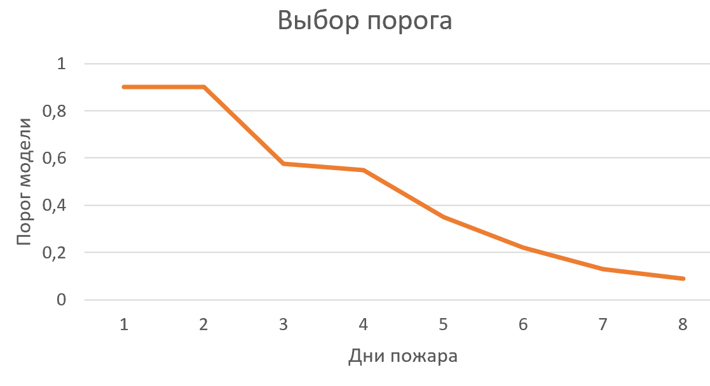

# NoFire_AIJorney2021
Solution the task NoFireWithAI for AI Journey Contest 2021

***Public score:*** 0.8972

***Public result:*** 6 место (iamteam)

### Description

Решение основано на предоставленном от организаторов бейзлайне: https://github.com/sberbank-ai/no_fire_with_ai_aij2021

Модели обучались аналогично данному бейзлайну.

Метамодель не использовалось. Для каждого таргета (пожар на 1ый, 2ой, ..., 8ой день) обучалась отдельная модель.

#### Подбор порога бинаризаций модели

Так как метрика соревнования довольно специфичная, штраф за ошибочное предсказание пожара в первый день намного больше ошибки в последующие дни.

Например, при правильном предсказании во все дни, кроме первого можем получить ошибку в 7 из 8 случаях:
<!--  -->

При этом за прогноз пожара позже реального ошибка удваивается. Поэтому порог для последующих дней надо уменьшать, чтобы не получить большую ошибку из-за прогноза позже истинного.

Таким образом, увеличим порог бинаризации для модели первого дня, чтобы максимально исключить вероятность ложноположительной ошибки модели первого дня. Далее постепенно будем уменьшать пороги для моделей следующих дней.

В результате оптимальное значение порога для каждой модели подбиралось индивидуально (на валидационной выборке, после чего проверялось на Public лидерборде).

Найденные оптимальные пороговые значения бинаризаций моделей представлены на графике:

<!--  -->

