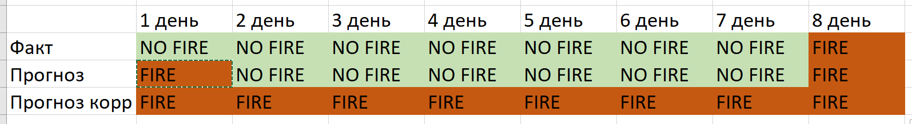

# NoFire_AIJorney2021
Solution the task NoFireWithAI for AI Journey Contest 2021

Решение основано на предоставленном от организаторов бейзлайне: https://github.com/sberbank-ai/no_fire_with_ai_aij2021

Модели обучались аналогично данному бейзлайну.

Метамодель не использовалось. Для каждого таргета (пожар на 1ый, 2ой, ..., 8ой день) обучалась отдельная модель.

Так как метрика соревнования довольно специфичная, штраф за ошибочное предсказание пожара в первый день намного больше ошибки в последующие дни.

Например, при правильном предсказании во все дни, кроме первого можем получить ошибку в 7 из 8 случаях:

В результате оптимальное значение порога для каждой модели подбиралось индивидуально (на валидационной выборке, после чего проверялось на Public лидерборде).

Оптимальные пороговые значения бинаризаций моделей представлены на графике:

![Изменение порога бинаризации моделей]{ width: 200px}(graphics/threshold_change.png)
